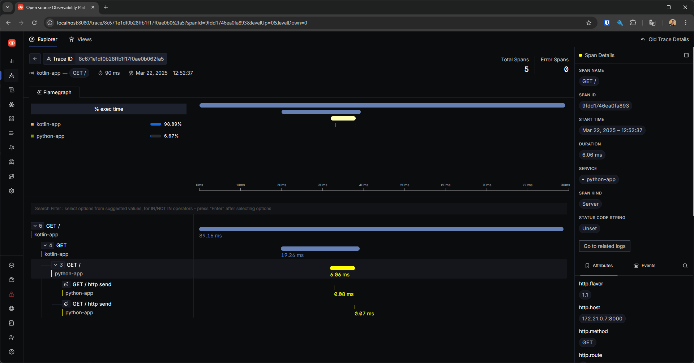

# Lab Observability

Este repositório contém um ambiente configurado para experimentação e aprendizado sobre observabilidade utilizando SigNoz incluindo monitoramento de métricas, rastreamento distribuído e logs centralizados.

## Clonando e inicializando submódulos

`git clone --recurse-submodules git@github.com:miguelsmuller/lab-observability.git`

Caso você já tenha clonado o repositório sem os submódulos

`git submodule update --init --recursive`

## Inicializando o ambiente

1. `docker compose -f signoz/deploy/docker/docker-compose.yaml up -d --build --force-recreate`

2. `docker compose up -d --build --force-recreate`

## Acessando a aplicação

Após inicializar o ambiente, você pode acessar a interface do SigNoz no navegador através do endereço:

- Signoz: http://localhost:8080
- Microserviço Kotlin: http://localhost:8081
- Microserviço Python: http://localhost:8082

## Recursos Úteis

- [Documentação do SigNoz](https://signoz.io/docs/)
- [Documentação do OTel](https://opentelemetry.io/docs/)

## Screenshot

